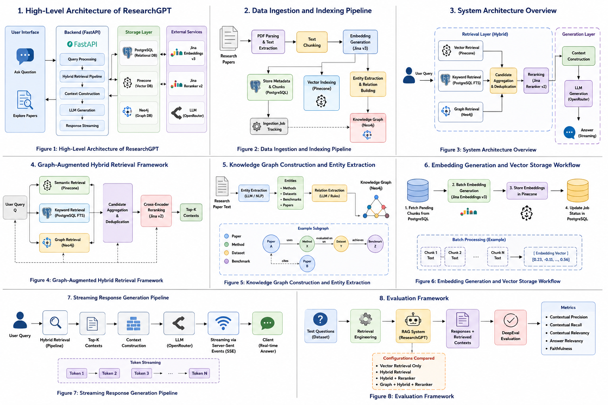
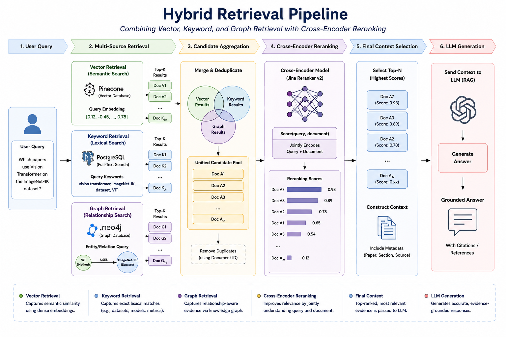
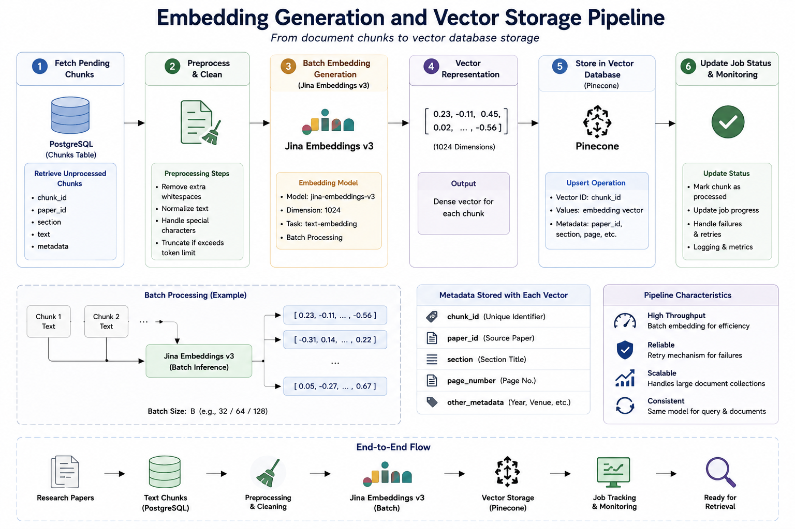
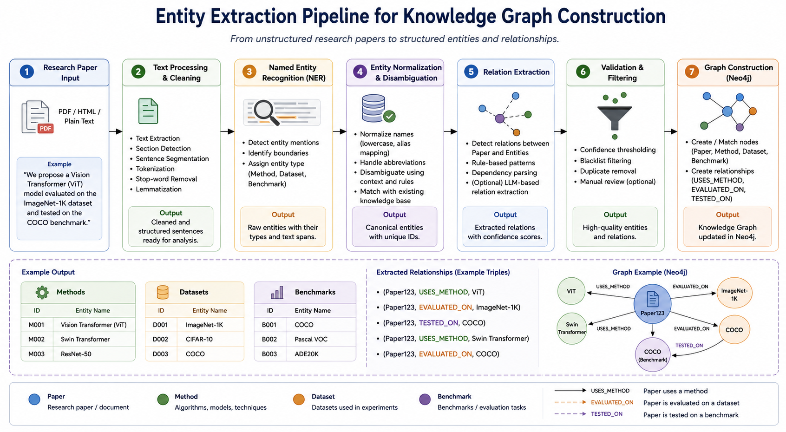
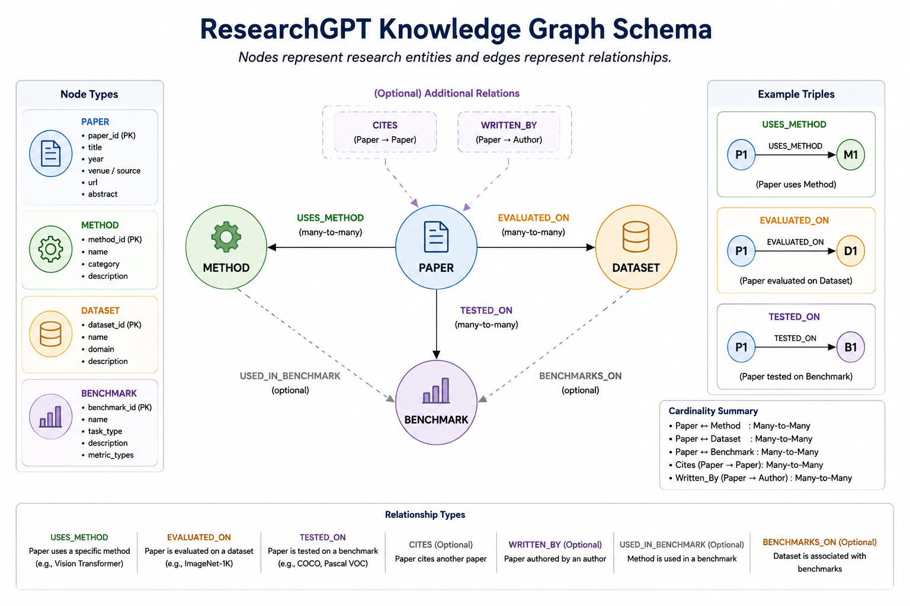
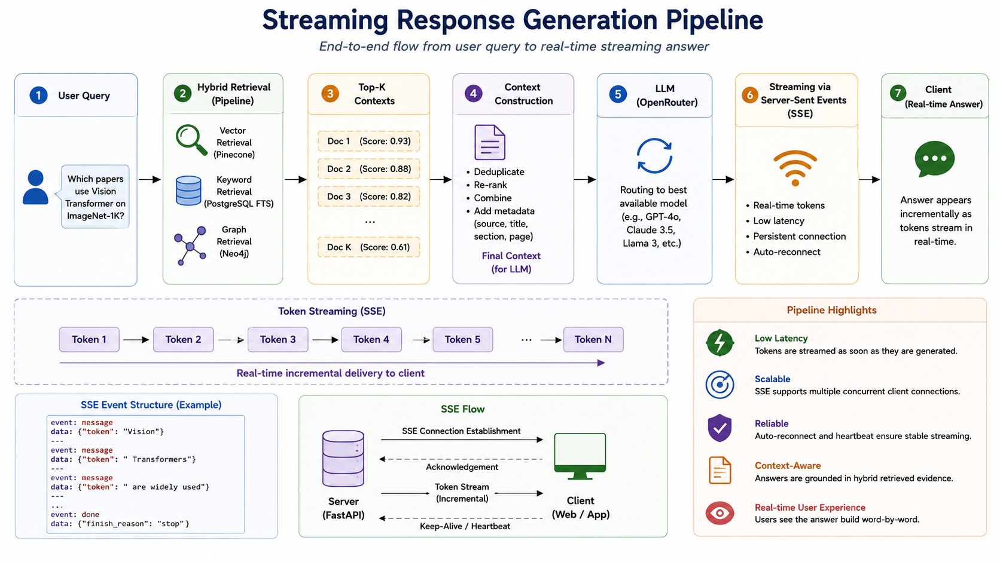

# I Stopped Building a Search Engine and Started Building an AI Teacher

### Why "finding the paper" was never the real problem — and what it looks like to design a retrieval system around teaching instead of ranking

---

Here's a pattern I kept running into while building research tools: retrieval quality would go up, the right papers would show up higher in the results, and users would still be stuck. They'd have the document open in one tab and a blank stare on their face in the other. Finding the paper was never actually the bottleneck. *Understanding* it was.

Scientific literature keeps growing — thousands of new papers a month across AI, ML, computer vision, NLP, and scientific computing alone. Open-access repositories and better search have genuinely solved the *access* problem. But access was never the hard part for most students, engineers, and even experienced researchers. The hard part is that a paper assumes you already know the terminology, the methodology lineage, and the three other papers it's quietly arguing with. Understanding a single contribution often means reading several papers, comparing methods, and reconstructing relationships that no single document spells out.

That's the gap **ResearchGPT** is built to close. Not a better search bar — an **evidence-grounded AI teacher** that retrieves scientific evidence and then *explains* it, while staying traceable back to the source the whole time.

*The complete system: an evidence-acquisition layer feeding a hybrid retrieval pipeline, which feeds a reranker, which feeds a generation layer designed to teach rather than just answer.*

---

## Retrieval finds documents. Teaching requires something more.

Most academic search tools stop at document discovery. They hand you a ranked list and consider the job done. ResearchGPT treats that as half the problem. The actual design goal is to take retrieved evidence and turn it into **explanation** — definitions, comparisons between methods, summaries of findings — while keeping every claim traceable to the paper it came from.

This sounds like a subtle reframing, but it changes what "good retrieval" even means. A search engine optimizes for *ranking the right document near the top*. A teacher needs to *gather enough of the right evidence, from enough angles, to explain a concept correctly* — which is a recall and coverage problem as much as a precision problem.

That reframing is why ResearchGPT's retrieval layer isn't one mechanism. It's three, run in parallel, for the same reason a good human teacher draws on more than one source before explaining something: different kinds of knowledge live in different kinds of structure.

- **Semantic retrieval** (Pinecone) catches concepts described in unfamiliar words — the same idea phrased three different ways across three different subfields.
- **Lexical retrieval** (PostgreSQL full-text search) catches exact terminology — dataset names, model versions, benchmark labels — that dense embeddings tend to blur.
- **Graph retrieval** (Neo4j) catches *relationships* — which papers use which methods on which datasets — that neither of the other two can reliably surface, because the connection isn't always spelled out in any single sentence.

*Three retrieval strategies run simultaneously, not sequentially — each one covering a blind spot the others share.*

The three result sets get merged into one candidate pool, then a **cross-encoder reranker** (Jina Reranker v2) re-scores every query-document pair jointly — looking at the query and the candidate together, rather than comparing two independently computed similarity scores. That step does two jobs at once: it pushes the most useful evidence to the top, and it filters out passages that are merely *topically adjacent* rather than actually useful for answering the question.

---

## Building the knowledge base: a paper isn't just text

Before any of that retrieval can happen, a paper has to be turned into something searchable in three different ways at once. ResearchGPT's ingestion pipeline runs continuously: papers are collected from scientific repositories along with their metadata, parsed into a consistent internal structure, and split into chunks small enough to retrieve precisely without losing surrounding context.

*Each chunk becomes a dense vector via Jina Embeddings v3 and lands in Pinecone with enough metadata — paper ID, section, page — to be reconstructed without an extra database round-trip.*

What makes this more than a standard RAG ingestion pipeline is the entity-extraction step running in parallel. As each paper comes in, the system identifies methods, datasets, benchmarks, and other domain-specific entities — the things a paper is actually *about*, not just the words it uses to talk about them.

*Seven stages turn unstructured text into structured triples — (Paper, USES_METHOD, ViT), (Paper, EVALUATED_ON, ImageNet-1K) — ready to be merged into the graph rather than duplicated across every paper that mentions the same method.*

Those entities become nodes in a Neo4j knowledge graph, connected to papers through typed edges — `USES_METHOD`, `EVALUATED_ON`, `TESTED_ON` — plus optional `CITES` and `WRITTEN_BY` relations for future expansion.

*A deliberately compact schema — four core node types, three primary edge types — chosen so it can be populated automatically during ingestion without manual graph curation.*

This is the layer that makes "which papers use method X on dataset Y?" answerable as a direct traversal instead of a hope that embedding similarity happens to reflect a relationship that was never explicitly stated.

---

## From evidence to explanation: the part that actually makes it a teacher

Here's where the system's design philosophy shows up most clearly. The retrieval layer's job is to find reliable evidence. The generation layer's job is to *transform* that evidence into something a person can learn from — and ResearchGPT keeps those two jobs deliberately separate.

When a question comes in, the hybrid retrieval pipeline runs, the reranker prioritizes the strongest evidence, and the surviving passages get organized into a structured context — preserving enough information for a real explanation while cutting anything irrelevant. That context goes to a language model operating under an explicit constraint: **answer from the evidence, not from memory.** The model isn't there to invent knowledge. It's there to turn retrieved evidence into something explainable — a definition, a comparison between two methods, a description of a dataset, an interpretation of a finding.

*Responses stream back to the user as Server-Sent Events rather than arriving all at once — tokens appear as they're generated, which matters more than it sounds like once explanations get long and technical.*

Two design principles hold this together:

**Traceability.** Every explanation is meant to be inspectable — connected back to the specific evidence it was built from, so a user can verify a claim instead of just trusting it.

**Separation of concerns.** Retrieval doesn't try to explain anything. Generation doesn't try to go find evidence on its own. Keeping that boundary clean is what keeps the system honest about what it actually knows versus what it's inferring.

---

## What this isn't (yet) — and why that's worth saying plainly

This paper is explicit about scope: it's an architecture and design paper, not an empirical validation. Comprehensive evaluation and user studies are framed as future work, not finished results. That's a meaningfully different claim than "we benchmarked this and it works," and it's worth taking seriously as a reader rather than skating past it.

The evaluation *framework* is built — DeepEval-based assessment across contextual precision, contextual recall, contextual relevancy, answer relevancy, and faithfulness — but the actual numbers, the ablations, the "does the graph layer measurably help" question, are still ahead.

*The measurement plan is in place — test questions, configuration comparisons, five scoring dimensions — but running it at scale and reporting results is explicitly future work, not a claim made here.*

The honestly-stated limitations are worth sitting with, because they're the real research agenda hiding inside the "limitations" section:

- **Entity extraction is the bottleneck, not the graph.** Methods described in prose — "we apply the approach introduced by [Author] et al." instead of naming the method outright — slip past automated extraction. The graph schema can hold far more relationship types than it currently does; what's missing is reliable extraction to populate it.
- **The graph supports relationship-aware retrieval, not deep reasoning.** It can tell you a paper uses a method. It can't yet chain that into "which datasets are used by papers that employ the same methods as paper X?" — true multi-hop reasoning over the graph is future work.
- **No personalization yet.** A beginner and a domain expert currently get the same explanation. Adapting depth and framing to the user's background is named explicitly as an open direction.
- **Language models can still misinterpret evidence**, even with grounding constraints in place. Human verification stays important for anything high-stakes.

None of that undercuts the core argument. It's the opposite — naming exactly where the architecture's current edges are is what makes the rest of the claims credible.

---

## Where the "AI teacher" framing actually points

The most interesting part of this paper isn't the current system — it's the direction the teaching framing points toward, because once you stop thinking of retrieval as a ranking problem, a different set of features becomes obvious:

- **Personalized explanations** that adapt to whether you're a student, a practitioner, or a domain expert — same evidence, different depth.
- **Research roadmaps** that introduce concepts, methods, and related work in a structured sequence, instead of answering one isolated question at a time.
- **Research gap discovery** — using the graph to spot underexplored combinations of methods, datasets, and benchmarks, rather than just retrieving what's already been studied.
- **Automated literature synthesis** — structured summaries of a sub-field's trends, built from many papers at once instead of one retrieval at a time.

None of these require new infrastructure so much as new reasoning layered on top of infrastructure that already exists — the graph, the hybrid retrieval pipeline, and the evidence-grounded generation step are already there. What's missing is comparison and aggregation logic running *on top* of retrieved evidence, not a new storage backend.

---

The bigger shift this paper represents isn't architectural — vector databases, knowledge graphs, and rerankers are all familiar RAG components individually. The shift is in what the system is *for*. Most retrieval-augmented systems are judged by whether they found the right document. This one is judged by whether a person walked away actually understanding something — and that's a genuinely different design target, one that shows up in every layer, from why three retrievers run in parallel to why the language model is told explicitly not to invent anything.

ResearchGPT isn't trying to replace the researcher or the reading. It's trying to make the reading faster to start and easier to trust — by always showing its work.

---

*ResearchGPT combines PostgreSQL (structured metadata + lexical search), Pinecone (semantic vector retrieval), Neo4j (knowledge graph traversal), Jina Embeddings v3 and Reranker v2, and LLM generation via OpenRouter — with evaluation planned around DeepEval's five-metric RAG framework.*

---

**More from me:**
🌐 **Live Demo:** [ResearchGPT](https://gvsai-rag-assistant.lovable.app/)

If you found this breakdown useful, a clap and a follow help more than you'd think — and I'd genuinely like to hear what you'd want an AI research teacher to do next.
